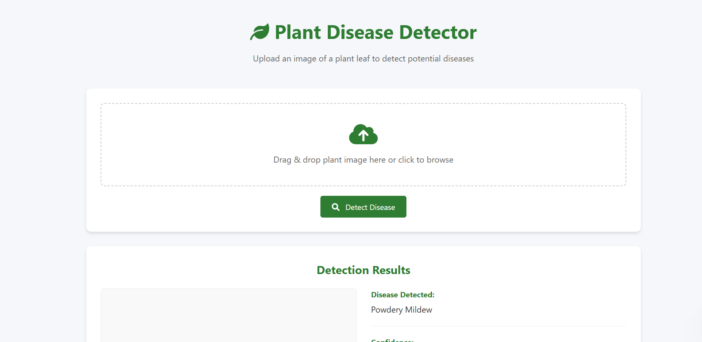

# 🌱 Plant Disease Detection System

   

A web application that detects plant diseases from leaf images using deep learning.

## Features
- 🖼️ Supports JPG, PNG, WEBP, BMP, GIF formats
- 🔍 Real-time disease classification
- 📊 Confidence percentage display
- 💡 Treatment recommendations
- 📱 Mobile-friendly interface

## Quick Start

### Prerequisites
- Python 3.8+
- TensorFlow 2.x
- Flask

  Installation
'''bash

-git clone https://github.com/Nanamshruthi/plant-disease-detector.git

-cd plant-disease-detector

-pip install -r requirements.txt

### Run the Application
- python app.py
- Access at: http://localhost:5000

### Project structure
📦 plant-disease-detector

├── 🐍 app.py                     # Flask backend (main application)

├── 🤖 model.h5                   # Trained TensorFlow/Keras model

├── 📜 requirements.txt           # Python dependencies

├── 📄 README.md                   # Project documentation

├── 📁 static/ # Static assets

    └── styles.css # Custom stylesheet

    └── script.js # Frontend interactivity

├── 📁 templates/ # HTML templates

     └── 🖥️ index.html # Main interface

└── 📂 uploads/ # User uploads (auto-created)

### Configuration
-To use your own model:
Replace model.h5 with your trained model

-Update labels in app.py

-To modify styles:
Edit static/styles.css

## 🛠 Troubleshooting

| Error               | Solution                                  |
|---------------------|-------------------------------------------|
| 400 Bad Request     | Check image format/size (max 16MB)        |
| Model not found     | Verify `model.h5` exists in root directory|
| Dependency errors   | Run `pip install -r requirements.txt`     |
